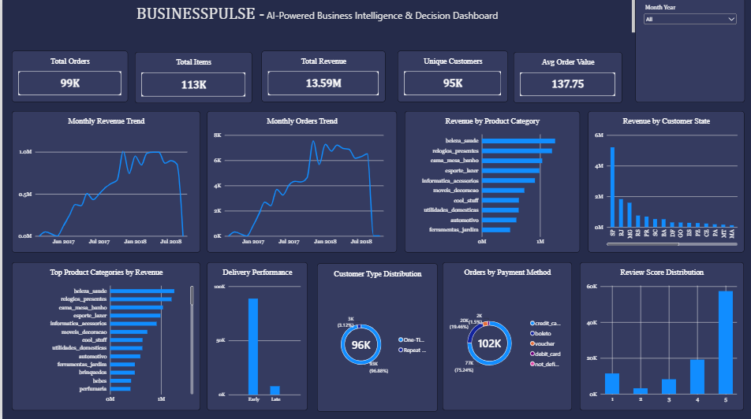
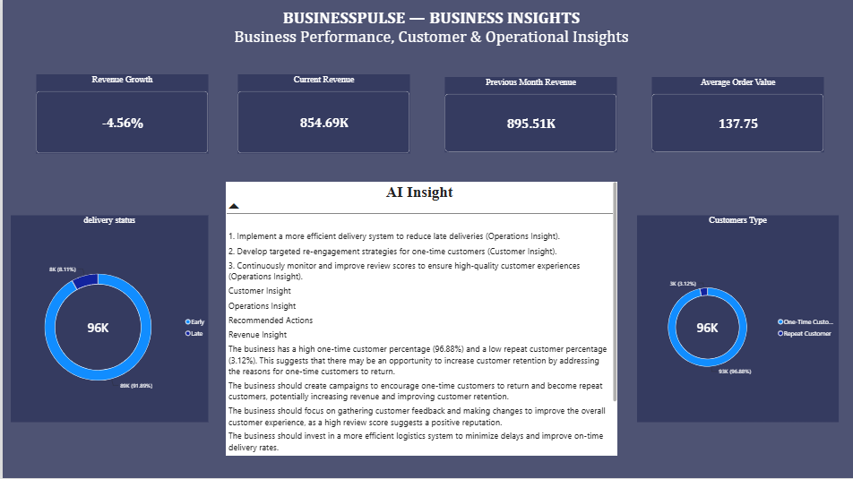

# BusinessPulse — AI-Powered Business Intelligence & Decision Platform

BusinessPulse is an end-to-end Business Intelligence platform that combines **PostgreSQL, SQL, Power BI, Python, DAX, and Generative AI** to transform e-commerce data into business insights and actionable recommendations.

The platform analyzes sales, customers, products, delivery performance, reviews, payments, sellers, and geographic performance, then uses a local LLM to generate AI-powered business recommendations.

---

## 🚀 Project Overview

BusinessPulse follows a hybrid analytics architecture:

**Raw Data → PostgreSQL → SQL Analytics → Power BI → Python AI Engine → LLM Recommendations**

The system separates reliable metric calculation from AI-generated interpretation:

- PostgreSQL and SQL calculate business metrics.
- Power BI provides interactive visualization and KPI monitoring.
- Python retrieves validated metrics from PostgreSQL.
- Ollama runs a local LLM to generate business insights.
- AI recommendations are saved automatically and displayed in the Power BI dashboard.

---

## 📸 Power BI Dashboard Preview

### Executive Dashboard



### Business Insights & AI Dashboard



---

## 📊 Key Business Metrics

The platform analyzes:

- 98K+ orders
- 112K+ items
- 13.59M+ total revenue
- 95K+ unique customers
- Average Order Value
- Revenue growth
- Delivery performance
- Customer retention
- Review performance
- Payment methods
- Product categories
- Seller performance
- Geographic performance

---

## 🧠 AI Recommendation Engine

BusinessPulse includes a local Generative AI layer using:

- Python
- Ollama
- Llama 3.2 3B
- PostgreSQL
- python-dotenv
- psycopg2

The AI engine retrieves current business metrics directly from PostgreSQL and generates:

### Revenue Insight
Identifies revenue trends and changes.

### Customer Insight
Analyzes one-time and repeat customer behavior.

### Operations Insight
Analyzes delivery performance and review metrics.

### Recommended Actions
Produces practical actions based on the available business metrics.

The generated insights are automatically saved to:

```text
dashboard/ai_insights.txt
```

## 📈 Power BI Dashboard

The Power BI dashboard contains two pages.

### Page 1 — Executive Dashboard

Includes:

- Total Orders
- Total Items
- Total Revenue
- Unique Customers
- Average Order Value
- Monthly Revenue Trend
- Monthly Orders Trend
- Customer Type Distribution
- Revenue by Product Category
- Payment Method Analysis
- Delivery Performance
- Revenue by State
- Review Score Distribution

### Page 2 — Business Insights

Includes:

- Revenue Growth
- Current Revenue
- Previous Month Revenue
- Average Order Value
- AI Business Insights
- Customer Type Distribution
- Delivery Performance

---

## 🗄️ SQL Analytics

BusinessPulse contains analytical SQL views covering:

1. Monthly Revenue
2. Product Category Performance
3. Top Products
4. Customer Type
5. Delivery Performance
6. Payment Methods
7. Review Analysis
8. Seller Performance
9. Order Status
10. State Performance
11. Monthly Orders
12. Customer Value
13. Dashboard KPIs

These views provide the foundation for the Power BI dashboard and AI recommendation engine.

---

## 🛠️ Technology Stack

### Programming

- Python
- SQL

### Data & Database

- PostgreSQL
- Pandas
- NumPy

### Business Intelligence

- Power BI
- DAX
- Excel

### AI / Machine Learning

- Generative AI
- Large Language Models (LLMs)
- Ollama
- Llama 3.2

### Development Tools

- VS Code
- Git
- GitHub
- Jupyter Notebook
- Python Virtual Environment

---

## 📁 Project Structure

```text
BusinessPulse/
│
├── dashboard/
│   ├── app.py
│   └── ai_insights.txt
│
├── data/
│   ├── raw/
│   └── processed/
│
├── docs/
│   └── business_requirements.md
│
├── notebooks/
│   └── 01_data_profiling.ipynb
│
├── sql/
│   ├── 01_order_performance.sql
│   ├── 02_customer_analysis.sql
│   ├── 03_product_analysis.sql
│   └── analytical_views.sql
│
├── src/
│   ├── ai_recommendation.py
│   ├── check_database.py
│   ├── data_cleaning.py
│   ├── data_validation.py
│   └── revalidate_processed_data.py
│
├── tests/
│   └── test_analytical_views.py
│
├── .env
├── .gitignore
└── README.md
```

> **Note:** `.env`, raw datasets, processed datasets, and the Python virtual environment are excluded from the GitHub repository through `.gitignore`.

---

## ⚙️ AI Pipeline

```text
PostgreSQL Database
        ↓
SQL Analytical Views
        ↓
Python AI Engine
        ↓
Business Metrics
        ↓
Ollama / Llama 3.2
        ↓
AI Business Insights
        ↓
dashboard/ai_insights.txt
        ↓
Power BI
```

---

## 🔄 End-to-End Workflow

```text
Raw E-commerce Data
        ↓
Data Cleaning & Validation
        ↓
PostgreSQL Database
        ↓
Analytical SQL Views
        ↓
Power BI Dashboard
        ↓
Python Metric Retrieval
        ↓
Ollama LLM
        ↓
AI Business Recommendations
        ↓
Power BI AI Insights
```

---

## ▶️ Running the AI Engine

### 1. Activate the virtual environment

Windows PowerShell:

```powershell
.venv\Scripts\activate
```

### 2. Make sure Ollama is installed

Check:

```powershell
ollama --version
```

### 3. Make sure the Llama model is available

```powershell
ollama pull llama3.2:3b
```

### 4. Run the BusinessPulse AI engine

```powershell
python src\ai_recommendation.py
```

The application:

1. Connects to PostgreSQL.
2. Retrieves validated business metrics.
3. Calculates business indicators.
4. Sends the metrics to the local LLM.
5. Generates business insights.
6. Saves the output to:

```text
dashboard/ai_insights.txt
```

7. The generated insights can then be refreshed into Power BI.

---

## 🧪 Testing

The analytical SQL views are tested using:

```powershell
pytest tests/test_analytical_views.py -v
```

The test suite validates the required BusinessPulse analytical views and their outputs.

Current analytical view test result:

```text
9 passed
```

---

## 🔐 Environment Configuration

Database credentials are stored locally in `.env`.

Example:

```text
DB_HOST=localhost
DB_NAME=businesspulse
DB_USER=postgres
DB_PASSWORD=your_password
DB_PORT=5432
```

The `.env` file is excluded from GitHub using `.gitignore`.

**Never commit database passwords, API keys, or other secrets to the repository.**

---

## 📊 Business Insights Generated

The AI layer currently analyzes metrics including:

| Metric | Example |
|---|---:|
| Total Orders | 98,666 |
| Total Items | 112,650 |
| Total Revenue | 13,591,643.70 |
| Unique Customers | 95,420 |
| Average Order Value | 137.75 |
| Revenue Growth | -4.56% |
| Early Delivery | 91.89% |
| Late Delivery | 8.11% |
| One-Time Customers | 96.88% |
| Repeat Customers | 3.12% |
| Average Review Score | 4.09 / 5 |

These metrics are retrieved from the BusinessPulse PostgreSQL database rather than being manually hard-coded into the AI engine.

---

## 🎯 Business Problems Addressed

BusinessPulse helps answer questions such as:

- How is revenue changing?
- What is the current business performance?
- Which product categories generate the most revenue?
- Which products perform best?
- How many customers return?
- What percentage of orders are delivered late?
- Which payment methods are commonly used?
- How are customer reviews distributed?
- Which states generate the most revenue?
- What business actions should management consider?

---

## 💡 Key Project Feature

The main feature of BusinessPulse is the combination of:

**Business Intelligence + Data Analytics + Generative AI**

Instead of only displaying charts and KPIs, the platform uses validated business metrics to generate natural-language business insights and recommended actions.

The architecture intentionally separates:

**Metric Calculation**

from

**AI Interpretation**

This allows SQL and Python to provide the numerical business facts while the LLM focuses on explaining those facts in natural language.

---

## 🏗️ Architecture

```text
                 ┌──────────────────────┐
                 │    E-commerce Data   │
                 └──────────┬───────────┘
                            │
                            ▼
                 ┌──────────────────────┐
                 │ Data Cleaning &      │
                 │ Validation           │
                 └──────────┬───────────┘
                            │
                            ▼
                 ┌──────────────────────┐
                 │ PostgreSQL Database  │
                 └──────────┬───────────┘
                            │
                            ▼
                 ┌──────────────────────┐
                 │ SQL Analytical Views │
                 └──────────┬───────────┘
                            │
                 ┌──────────┴───────────┐
                 ▼                      ▼
        ┌─────────────────┐    ┌─────────────────┐
        │    Power BI     │    │  Python AI      │
        │    Dashboard    │    │     Engine      │
        └────────┬────────┘    └────────┬────────┘
                 │                      │
                 │                      ▼
                 │             ┌─────────────────┐
                 │             │ Ollama / Llama  │
                 │             │      3.2        │
                 │             └────────┬────────┘
                 │                      │
                 │                      ▼
                 │             ┌─────────────────┐
                 │             │ AI Business     │
                 │             │ Insights        │
                 │             └────────┬────────┘
                 │                      │
                 └──────────┬───────────┘
                            ▼
                 ┌──────────────────────┐
                 │ BusinessPulse       │
                 │ Decision Platform    │
                 └──────────────────────┘
```

---

## 🔧 Data & Analytics Capabilities

The project demonstrates experience with:

- Relational database design
- SQL querying
- Analytical SQL views
- Data cleaning
- Data validation
- Exploratory data analysis
- KPI development
- Business intelligence
- DAX measures
- Dashboard development
- Generative AI integration
- LLM-based business analysis
- Automated insight generation
- Git/GitHub version control
- Python testing

---

## 🎓 Project Learning Outcomes

Through BusinessPulse, the project demonstrates practical experience building an end-to-end analytics and AI application rather than an isolated machine learning model.

Key areas include:

- Connecting Python applications to PostgreSQL
- Building reusable SQL analytical views
- Creating executive Power BI dashboards
- Developing DAX business metrics
- Integrating a local LLM using Ollama
- Designing an AI recommendation workflow
- Validating analytical outputs
- Structuring a production-style Python project
- Using Git and GitHub for version control

---

## 👩‍💻 Author

**Sariga C**

B.E. Computer Science and Engineering

Aspiring AI / Data Professional

---

## 📌 Project Status

**Core Development Completed**

- PostgreSQL database and data processing ✅
- SQL analytical views and testing ✅
- Power BI Executive Dashboard ✅
- Business Insights Dashboard ✅
- DAX business measures ✅
- Python AI recommendation engine ✅
- Ollama / Llama 3.2 integration ✅
- PostgreSQL → AI integration ✅
- AI Insights integrated into Power BI ✅
- Git/GitHub integration ✅